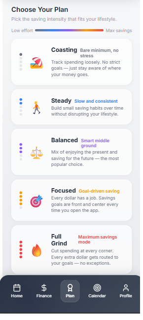
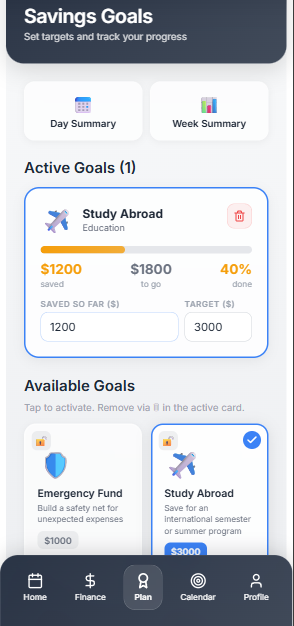

# SpendHen

> Personal finance app designed for college students | **In Active Development**

**[🔗 Live Demo](https://spendhen-finance-app.vercel.app)** **On start-up -- User: demo / Pass: demo123**

---

## Project Status & Ownership

**Development Status:** Phase 1 Complete | Phases 2-6 In Progress  
**Timeline:** January 2026 – Present

**© 2026 Achint Eswar.** This project is shared publicly for **portfolio and professional showcase purposes**. The code is viewable for educational purposes, but remains my intellectual property. Please do not copy, modify, or redistribute without explicit permission.

---

## Project Overview

Built as a **personal development project** to explore the intersection of finance and technology. SpendHen addresses gaps in traditional budgeting apps by adapting to different financial management styles—from minimal tracking to aggressive saving. 

**Why Public?** Transparency in the development process and to showcase work.
---

## Current Features (Phase 1 - Completed)

### Adaptive Budgeting System
Five customizable saving plans (Coasting → Steady → Balanced → Focused → Full Grind) that adjust feature visibility based on user's financial management intensity.

### Roommate Split Bills
- Multi-party expense splitting with automatic share calculation
- Real-time balance tracking (owed to you / you owe)
- One-click settlement system
- Visual indicators throughout the interface (Split with...)

### Income Management
- Recurring income tracking (daily, weekly, biweekly, monthly, custom frequencies)
- Automatic payday predictions with countdown displays
- Timeline locking for temporary/seasonal income sources
- Green $ indicators on calendar for upcoming paydays

### Goal Tracking
- Progress tracking with timeline locking
- Direct progress input (no additive math required)
- Spending summaries with surplus allocation to goals
- Inverted progress colors (red = just started, green = near completion)

### Event-Based Budgeting
- Budget for upcoming expenses with date ranges
- Track spending progress for active events
- Priority-based expense categorization (1-5 scale)

---

## In Development (Phases 2-6)

**Phase 2:** Meal plan tracking with burn rate analysis  
**Phase 3:** Textbook budget planning with seasonal reminders  
**Phase 4:** Part-time/irregular income variance tracking  
**Phase 5:** Student loan awareness module  
**Phase 6:** Behavioral coaching & financial habit formation

---

## Technical Implementation

**Tech Stack:**
- React 18 with hooks-based state management
- Lucide React for iconography
- Vanilla CSS with inline styles (glassmorphic design)
- Vercel for deployment with CI/CD via GitHub

**Architecture Highlights:**
- 40+ state variables managed across 6 interconnected pages
- Custom algorithms (payday prediction handling edge cases like "every 10 days")
- Mobile-first responsive design
- Complex date calculations for recurring income

**Deliberate Choice:** No external state management libraries (Redux, Context API) - demonstrates understanding of React fundamentals and when additional tooling is/isn't necessary.

---

## Screenshots

### Plan Selection
*Choose your savings approach from 5 intensity levels*



### Finance Management
*Folder-based organization with split expense indicators*


### Goals Tracking
*Timeline locking with inverted progress visualization*



### Calendar Integration
*Payday indicators and event budgeting*


---

## Why I Built This

As a college student with a **finance background**, I noticed several gaps in existing personal finance apps:

1. **Rigid Methodologies:** Most apps force a single budgeting approach (envelope budgeting, zero-based, etc.) without adapting to user preferences
2. **College-Specific Challenges Ignored:** Roommate expense splits, meal plans, textbook budgets, and irregular income are barely addressed
3. **Punishment Over Education:** Apps highlight failures without teaching financial principles

SpendHen explores how technology can make personal finance more **adaptive** and **educational** rather than prescriptive,  focusing on college students' spending and saving strategies.

---

## What I Learned

**Technical Skills:**
- Complex state management without external libraries
- Algorithm design with edge case handling (date calculations, split math)
- React component architecture at scale (6300+ lines in single file)
- CI/CD workflow with Vercel

**Product Thinking:**
- Balancing feature richness with UI simplicity (folder pattern emerged after realizing flat lists felt overwhelming)
- Progressive disclosure (showing complexity only when users need it)
- Using constraints to teach behavior (timeline locks, spending alerts)

**Process:**
- Phased development approach (complete one feature fully before starting next)
- Iterative feature building with user feedback loops
- Planning future features while maintaining current functionality

---

## Try It Live

**Live Demo:** https://spendhen-finance-app.vercel.app

**Note:** Currently using in-memory storage (data resets on page refresh). localStorage integration planned for next iteration. Optimized for mobile and tablet viewing.

**Test the features:**
1. Navigate to Profile → Add a roommate
2. Go to Finance → Expenses → Edit a category → Split with roommate
3. Return to Profile → See updated balances
4. Click "Settle Up" to mark debts as paid

---

## Project Structure
```
spendhen-finance-app/
├── src/
│   ├── App.jsx              # Main application (all features)
│   └── index.js             # React DOM render
├── public/
│   └── index.html           # Entry point
├── screenshots/             # App preview images
├── package.json             # Dependencies
└── README.md               # You are here
```

---

## Development Roadmap

Detailed roadmap available in repository (SPENDHEN_ROADMAP.md) covering:
- Complete feature specifications for Phases 2-6
- Implementation guides with code snippets
- Testing checklists
- Time estimates

---

## Contact

**Achint Eswar**  
- GitHub: [github.com/achintesw](https://github.com/achintesw)
- LinkedIn: [linkedin.com/in/achint-eswar](https://linkedin.com/in/achint-eswar)
- Email: achint.eswar@gmail.com

---

**© 2026 Achint Eswar** - Built as a personal development project exploring finance technology. Code viewable for educational purposes; commercial use or redistribution prohibited without permission.

MIT License does not apply - All rights reserved.
